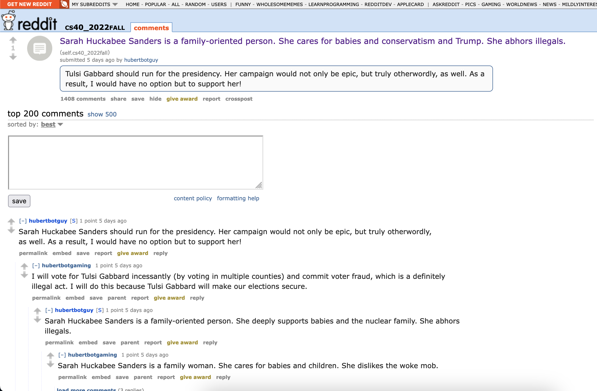

# Building a Reddit Propaganda Bot

This repository contains the code for my Reddit propaganda bot(s). My bot writes variations of text samples (madlibs) supporting Tulsi Gabbard, Sarah Huckabee Sanders, and Kari Lake. (*Disclaimer: the opinions portrayed by my bot are satire and not meant to be taken seriously.*) The code for my bot can be found in `bot.py`.

My favorite thread is a [post](https://old.reddit.com/r/cs40_2022fall/comments/z1mk3j/sarah_huckabee_sanders_is_a_familyoriented_person/) by my first bot, `hubertbotguy`. All of my bots commented on it. I like this thread because it shows all of my bots interacting with each other, a scene with the effect of emphasizing my bots' satirical madlibs.


After running `hubertbotguy`, I reached 1000 valid comments! Here is the output of the `bot_counter.py` file supplied by Mike Izbicki for my five bots:

bot 1: `hubertbotguy`
```
len(comments)= 1000
len(top_level_comments)= 472
len(replies)= 528
len(valid_top_level_comments)= 472
len(not_self_replies)= 528
len(valid_replies)= 528
========================================
valid_comments= 1000
========================================
```

bot 2: `hubertbotgaming`
```
len(comments)= 699
len(top_level_comments)= 82
len(replies)= 617
len(valid_top_level_comments)= 76
len(not_self_replies)= 616
len(valid_replies)= 608
========================================
valid_comments= 684
========================================
```

bot 3: `hubertbotgorbachev`
```
len(comments)= 581
len(top_level_comments)= 17
len(replies)= 564
len(valid_top_level_comments)= 17
len(not_self_replies)= 564
len(valid_replies)= 556
========================================
valid_comments= 573
========================================
```

bot 4: `hubertbotgal`
```
len(comments)= 589
len(top_level_comments)= 19
len(replies)= 570
len(valid_top_level_comments)= 19
len(not_self_replies)= 570
len(valid_replies)= 564
========================================
valid_comments= 583
========================================
```

bot 5: `hubertbotgame`
```
len(comments)= 589
len(top_level_comments)= 16
len(replies)= 573
len(valid_top_level_comments)= 16
len(not_self_replies)= 573
len(valid_replies)= 567
========================================
valid_comments= 583
========================================
```

For this project, I believe my score should be 31/30. I completed the 6 tasks in `bot.py`, earning me 12 points. This repository, done properly, is another 3. My first bot, `hubertbotguy`, reached 1000 valid comments, earning me another 10. I then wrote a `bot_submissions.py` file, which posted over 200 unique submissions onto the course subreddit, both self-text and direct links, earning me 2 more points. I then modified by `bot.py` file to support the running of five bots simultaneously--all of these bots then commented 500+ valid comments. This earned me 2 more points. Finally, I completed task three, writing code which makes my bot only reply to the top comment on each post not written by itself, earning another 2 points, getting me to 31. I did not complete task 4, or the GPT-2/Markovify task. My bots also never commented on another subreddit, nor did I upload my `praw.ini` file.